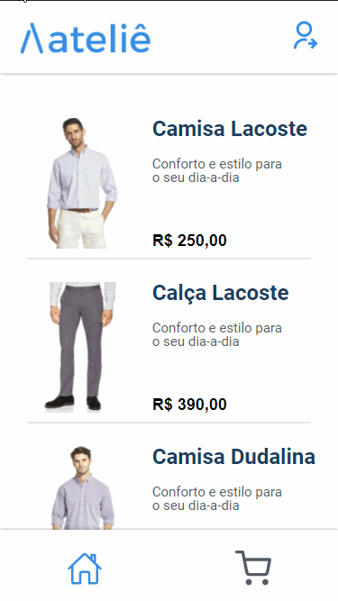

<h1 align="center">
   🛍️ <a href="#"> Atelie </a>
</h1>

<h3 align="center">
    Your best dress shop
</h3>

<h4 align="center"> 
	 Status: Finished
</h4>

<p align="center">
 <a href="#about">About</a> •
 <a href="#layout">Layout</a> • 
 <a href="#how-it-works">How it works</a> • 
 <a href="#pre-requisites">Pre-requisites</a> • 
 <a href="#tech-stack">Tech Stack</a> • 
 <a href="#how-to-contribute">How to contribute</a> • 
 <a href="#author">Author</a>
</p>


## About

Aiming to make you more elegant and safe, Atelie provides exclusive clothes for your look. You can browse our website and see all the products, which have pieces from sizes P to G. Seeking to ensure a good experience, when you complete your purchase, you will receive an email with all information about the products and payment method selected.

---


## Layout

<div align="center">
 
</div>

This layout was completely made by us :)


---

## How it works

This project is divided into two parts:
1. Backend (You can find here: https://github.com/okitauehara/gratibox-api)
2. Frontend (This repository)

---

## Pre-requisites

Before you begin, you will need to have the following tools installed on your machine:
[Git](https://git-scm.com), [Node.js](https://nodejs.org/en/), [VSCode](https://code.visualstudio.com/).

### Running the Frontend


``` jsx

// Clone this repository
$ git clone git@github.com:okitauehara/atelie-front.git

// Access the project folder cmd/terminal
$ cd atelie-front

// Install the dependencies
$ npm install

// If you want to run your app on localhost, create a .env file with the environment variable pointing to your local server.

// Run the application in development mode
$ npm start

// The server will start at port: 3000

```

You can find an .env.example <a href="https://github.com/okitauehara/atelie-front/blob/main/.env.example">here</a>.


---

## Tech Stack

The following tools were used in the construction of the project:

**Frontend**  ([React](https://reactjs.org/))

-   **[Axios](https://github.com/axios/axios)**
-   **[React-icons](https://github.com/react-icons/react-icons)**
-   **[React-loader-spinner](https://github.com/mhnpd/react-loader-spinner)**
-   **[React-router-dom](https://github.com/remix-run/react-router)**
-   **[Styled-components](https://github.com/styled-components/styled-components)**
-   **[SweetAlert2](https://github.com/sweetalert2/sweetalert2)**
-   **[Husky](https://github.com/typicode/husky)**
-   **[Eslint - Airbnb](https://github.com/airbnb/javascript)**
-   **[Prettier](https://github.com/prettier/prettier)**

> See the file  [package.json](https://github.com/okitauehara/atelie-front/blob/main/package.json)


---


## How to contribute

1. Fork the project.
2. Create a new branch with your changes: `git checkout -b feat/myFeatureName`
3. For each feature implemented, make a commit specifying what was done
4. Submit your changes: `git push -u origin feat/myFeatureName`

---

## Author

Developed by Marcos Okita Uehara and Samuel Felipe Castro Fernandes.